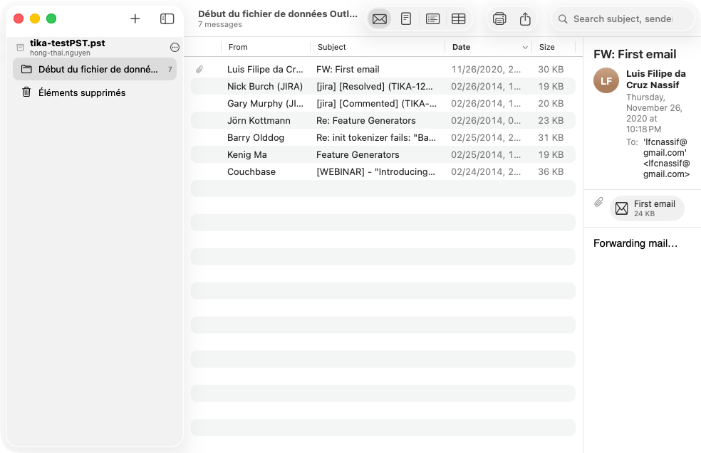
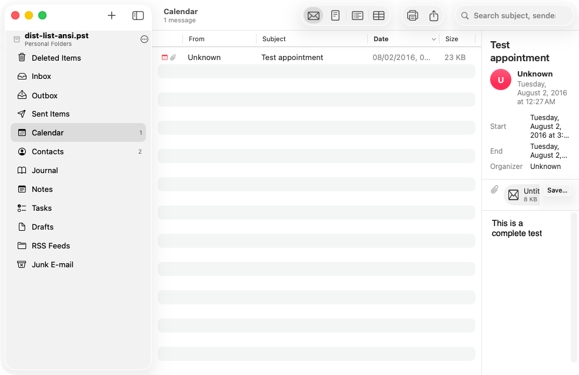
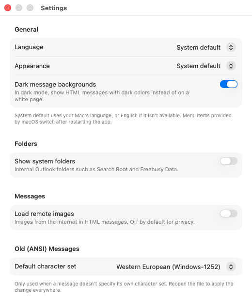

# PST Viewer for macOS

A simple, fast viewer for Outlook archives (`.pst` and `.ost`) and old mbox mail (Netscape, Mozilla, Thunderbird) on the Mac — no Outlook, no conversion, read-only. Built for old archives, but works with new ones too.



## Features

- **All PST formats**: ANSI (Outlook 97–2002, the old 2 GB files), Unicode (Outlook 2003 and later) and OST (including the Outlook 2013+ variant with 4K pages and compression).
- **All PST encryption types** (none, "compressible" and "high").
- **Mbox mail folders**: open a folder of mail from Netscape Communicator, Mozilla or Thunderbird and browse it with the same interface. See [Old mbox mail](#old-mbox-mail-netscape-thunderbird).
- **Three columns** like Outlook and Mail: folder tree → message list → preview.
- **Several files at once** in the sidebar, each listed under its file name.
- **Messages** in HTML, RTF (old Outlook messages) or plain text, with embedded images (`cid:`).
- **Sent items show recipients**: in Sent Items, Outbox and Drafts the list shows who a message went to (To, or Cc) instead of yourself.
- **Attachments**: Quick Look, open, save, or save all at once. Attached messages (forwarded mail) can be opened in turn.
- **Contacts, calendar items and tasks** with their own fields (email, phone, start/end, location…).
- **Search** by subject, sender or recipient, in the current folder or in all folders, optionally in the message text as well.
- **Sorting** by sender, subject, date and size; unread messages in bold.
- **Export** to `.eml` (opens in Apple Mail), a whole folder as `.eml` files, or as `.mbox` (imports into Apple Mail and Thunderbird).
- **Headers and all MAPI properties** for anyone who wants to know exactly what's inside.
- **English and Dutch**: follows your Mac's language by default (English when the language isn't available); switch in Settings.
- **Light and dark mode**: follows the system or can be set in Settings; HTML mail can be shown with dark colours in dark mode.
- **Native look**: on macOS 26 the app uses Liquid Glass toolbars and controls.
- **Privacy**: remote images in HTML mail are blocked by default; JavaScript is always off.
- **Configurable character set** for old ANSI messages that don't specify one (Western European/Windows-1252 by default).



## Installation

### Option 1: build it yourself (recommended)

Requires macOS 13 (Ventura) or later and the Xcode Command Line Tools (`xcode-select --install`). Building with Xcode 26 or Command Line Tools 26 gives the app the macOS 26 Liquid Glass look; older tools build the classic look.

```bash
git clone https://github.com/mukreb/mac-pst-viewer.git
cd mac-pst-viewer
./scripts/build-app.sh
open "dist/PST Viewer.app"
```

Then drag `dist/PST Viewer.app` to your Applications folder. You can open a `.pst` via **File → Open PST File or Mail Folder…** (⌘O), by dragging the file onto the window, or with "Open With" in the Finder.

### Option 2: ready-made download

Every build on GitHub Actions produces a universal app (Apple Silicon + Intel) that you can download under **Actions → Build → Artifacts → PST-Viewer-macOS**. Because the app isn't notarized by Apple, the first time you have to right-click the app → **Open**, or run in Terminal:

```bash
xattr -dr com.apple.quarantine "PST Viewer.app"
```

## Settings

Open **PST Viewer → Settings…** (⌘,) for:

- **Language**: System default, English or Nederlands. The app's own texts switch immediately; menu items provided by macOS follow after restarting the app.
- **Appearance**: System default, Light or Dark, and whether HTML messages get dark colours in dark mode.
- **Show system folders**, **load remote images** and the **default character set** for old ANSI messages.



## Old mbox mail (Netscape, Thunderbird)

Netscape Communicator 4.x, Mozilla and Thunderbird keep every mail folder as an **mbox** file without an extension (`Inbox`, `Sent`, `Trash`, …). Subfolders of a folder `Projects` are in a directory `Projects.sbd`. The `.snm` (Netscape) and `.msf` (Mozilla, Thunderbird) files next to them are summary indexes; PST Viewer doesn't need them.

To view such an archive, choose **File → Open PST File or Mail Folder…** and select the folder that contains `Inbox`, `Sent` and the other files, or drag that folder onto the window. The folder tree, message list, search, attachments and export then work as for a PST file. You can also open a single mbox file, an Apple Mail export (`Name.mbox`) or a folder that contains several such archives.

Details:

- **Deleted messages**: Netscape didn't remove deleted messages from the file straight away, it only marked them (until you "compacted" the folder). Those messages are hidden; **File Info** shows how many there are.
- **Read/unread** comes from Netscape's `X-Mozilla-Status` header, or from the `Status` header of other mail programs.
- **Attachments** in MIME messages as well as old uuencoded attachments (`begin 644 …`) are shown as attachments. Forwarded messages (`message/rfc822`) can be opened in turn.
- **Character sets**: headers and texts in old mail often contain unmarked 8-bit text; for those the default character set from Settings is used.
- **Export** to `.eml` writes the original message byte for byte.

## Command line

There's also a small tool, `pstdump` (works on macOS and Linux). It also reads mbox files and mail folders:

```bash
swift run pstdump archive.pst              # folder tree with counts
swift run pstdump "Netscape Mail" --messages   # an mbox mail folder
swift run pstdump archive.pst --messages   # folders + message list
swift run pstdump archive.pst --show 0x200024   # a single message
swift run pstdump archive.pst --eml 0x200024 > message.eml
```

## How it works

`Sources/PSTKit` is a PST reader written from scratch in pure Swift, without external dependencies, based on the public [MS-PST](https://learn.microsoft.com/en-us/openspecs/office_file_formats/ms-pst/) specification:

| File | Layer |
|------|-------|
| `NDB.swift` | File header, node and block B-trees, data blocks, subnodes, encryption |
| `LTP.swift` | Heap-on-Node, BTree-on-Heap, Property Context, Table Context |
| `PSTFile.swift`, `Message.swift` | Folders, messages, recipients, attachments, named properties |
| `RTF.swift` | LZFu decompression, extracting HTML from RTF, RTF → text |
| `Inflate.swift` | Deflate decoder for compressed OST 2013 blocks |
| `EMLWriter.swift` | Export to `.eml` and `.mbox` |
| `MailStore.swift` | The interface the app uses for both PST files and mbox archives |
| `Mbox.swift` | Mbox files and Netscape/Thunderbird folder trees (`.sbd`) |
| `MIME.swift`, `MIMEContent.swift` | MIME parser (multipart, base64, quoted-printable, RFC 2047/2231, uuencode) |
| `Localization.swift` | English/Dutch texts (`tr("English", "Nederlands")`) |

The app itself (`Sources/PSTViewer`) is SwiftUI.

The file is opened memory-mapped and never modified.

## Testing

```bash
swift test
```

The tests run against real PST files in `Tests/PSTKitTests/Fixtures` (see the README there for their origin) and a Netscape-style mail folder generated by `scripts/make_mbox_fixture.py`. Because there are hardly any public ANSI sample files, `scripts/make_ansi_pst.py` converts a Unicode PST into a genuine ANSI file; the result has been verified with the independent libpff library.

## License

MIT
